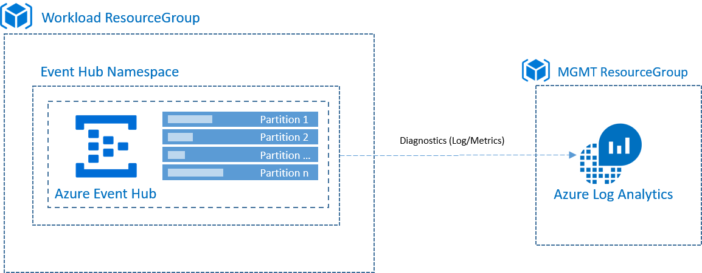
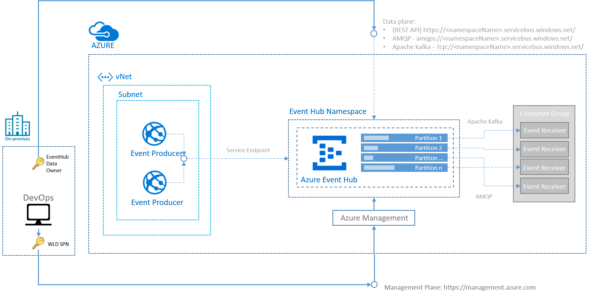

# **Event Hubs**

[](https://dev.azure.com/SantanderCCoE/CCoE/_apis/build/status/Products/ccoe.products.az.event-hub-s1?branchName=master)

## Overview

### Acronym
Acronym for the product is **aeh**, check [List of Acronyms](https://confluence.ci.gsnet.corp/display/OPTIMUM/List%2Bof%2BAcronyms) for a complete list of acronyms

### Description
> Azure Event Hubs is a big data streaming platform and event ingestion service. It can receive and process millions of events per second. Data sent to an event hubscan be transformed and stored by using any real-time analytics provider or batching/storage adapters.
> 
> Event Hubs provides a Kafka endpoint that can be used by your existing Kafka based applications as an alternative to running your own Kafka cluster. Event Hubs supports Apache Kafka protocol 1.0 and later, and works with your existing Kafka applications, including MirrorMaker.

### Public Documentation
[Azure event hubsOverview](https://docs.microsoft.com/en-us/azure/event-hubs/)

### Version
|Version|Target SCF|
|:--|:--|
|1.2.0|SM|

### Target Audience
|Audience |Purpose  |
|--|--|
| Cloud Center of Excellence | Understand the Design of this Service |
| Cybersecurity Hub | Understand how the Security Framework is implemented in this Service and who is responsible of each control |
| Service Management Hub | Understand how the Service can be managed according to the Service Management Framework |

### Configuration

The product supports the following custom configuration:

|Parameter| Tf Name | Default Value | Type |Mandatory |Others |
|:--|:--:|:--:|:--:|:--:|:--|
|Name|name||string|yes||
|Resource Group Name|resource_group||string|yes|The name of the resource group in which to create the Event Hubs|
|Location|location||string|yes||
|Log Analytics Workspace|log_analytics_workspace_id||string|yes|Specifies the ID of a Log Analytics Workspace where Diagnostics Data should be sent|
|Analytics Diagnostic Monitor|analytics_diagnostic_monitor||string|yes|Specifies the name of the Diagnostic Setting|
|SKU Tier|event_hub_sku_tier|Standard|string|yes|Basic or Standard|
|SKU Capacity|event_hub_sku_capacity|1|int|yes|Throughput units, value should be 1 to 20 throughput units|
|Message retention| event_hub_msg_retention| 7 | int | yes|Number of days to retain the events for this Event Hubs, value should be 1 to 7 days|
|Partition Count| event_hub_partition_count | 1 | int | yes | Number of partitions created, allowed values are from 1 to 32 partitions|
|IP Filtering| event_hub_ips_filter | Doesn't apply | string array | no |List of IP or IP ranges|
|VNET Endpoint|event_hub_snet_ids| Doesn't apply | string array | no |List of subnet **IDs**|
|Tag Channel| channel| n/a | string| no| |
|Tag Description| description| n/a | string| yes| |
|Tag Tracking Code| tracking_code| n/a | string| yes| |
|Tag CIA| cia| n/a | string| yes| Confidentiality-Integrity-Availability|

## Usage

Include the next code into your main.tf file:

```hcl
module "event_hub" {
  source = "<event_hub module source>"

  name                    = var.name
  resource_group          = var.resource_group
  location                = var.location
  cia                     = var.cia
  channel                 = var.channel
  description             = var.description
  tracking_code           = var.tracking_code
  log_analytics_workspace_id   = var.log_analytics_workspace_id
  analytics_diagnostic_monitor = var.analytics_diagnostic_monitor
  event_hub_sku_tier        = var.event_hub_sku_tier 
  event_hub_sku_capacity    = var.event_hub_sku_capacity
  event_hub_msg_retention   = var.event_hub_msg_retention
  event_hub_partition_count = var.event_hub_partition_count
  event_hub_snet_ids        = var.event_hub_snet_ids
  event_hub_ips_filter      = var.event_hub_ips_filter
}
```

You can watch more details about [Event Hubs configuration parameters](/variables.tf).

### Dependencies
The following resources must exist before the deployment can take place:

- Azure Subscription.
- Resource Group.
- Azure Active Directory Tenant.
- Log Analytics Workspace (formerly OMS) for health logs and metrics.
- A deployment Service Principal with owner permissions on the resource group.
- If it is defined subnets as parameter, they must have enabled **Microsoft.EventHub** as **service endpoint**. 

### Prerequisites

Virtual networks are supported in Standard and dedicated tiers of Event Hubs. It's not supported in Basic tier.

## Architecture


## Networking

### Network topology


### Exposed product endpoints
The following endpoints can be used to consume or manage the Certified Product:

#### Management endpoints (Control Plane)
These endpoints will allow to make changes in the configuration of the Certified Service, change permissions or make application deployments.

|EndPoint|IP/URL  |Protocol|Port|Authorization|
|:-|:-|--|--|:-|
|Azure Resource Management REST API|https://management.azure.com/|HTTPS|443|Azure Active Directory|

#### Consumption endpoints (Data Plane)
These endpoints will allow you to consume the Certified Service from an application perspective.

|EndPoint|IP/URL  |Protocol|Port|Authorization|
|:-|:-|--|--|:-|
|REST API|https://<namespaceName>.servicebus.windows.net/|HTTPS|443|SAS|
|AMQP|amqps://<namespaceName>.servicebus.windows.net/|AMQPs|5671|SAS|
|Kafka API|tcp://<namespaceName>.servicebus.windows.net/|TCP||SASL PLAIN for authentication and SASL SSL for transport security|

# **Security Framework**
This section explains how the different aspects to have into account in order to meet the Security Control Framework for this Certified Service. 

This product has been certified for the [Security Control Framework v1.2](https://teams.microsoft.com/l/file/E7EFF375-EEFB-4526-A878-3C17A220F63C?tenantId=72f988bf-86f1-41af-91ab-2d7cd011db47&fileType=docx&objectUrl=https%3A%2F%2Fmicrosofteur.sharepoint.com%2Fteams%2FOptimum-SanatanderAzureFoundationsProject%2FShared%20Documents%2FCCoE-Channel%2FSecurity%20Control%20Framework%2FSantander%20-%20CCoE%20-%20Security%20Control%20Framework%20-%20v1.2.docx&baseUrl=https%3A%2F%2Fmicrosofteur.sharepoint.com%2Fteams%2FOptimum-SanatanderAzureFoundationsProject&serviceName=teams&threadId=19:e20a3726dc824141b32579df437f7a66@thread.skype&groupId=26385c5b-85e4-4376-988a-27ed549d9419) revision

### Considerations
- This product only supports Medium controls (no advanced BYOK/CMEK).

- Application Encryption will be responsibility of the DevOps


## Security Controls based on Security Control Framework

### Foundation (**F**) Controls for Rated Workloads
|SF#|What|How it is implemented in the Product|Who|
|--|:---|:---|:--|
|SF1|Resource Tagging on all resources|Product includes all required tags in the deployment template|CCoE|
|SF2|IAM on all accounts|CCoE RBAC model for products certifies right level of access to the Event Hubs. Only Azure AD RBAC access is enabled for the product|CCoE|
|SF3|MFA on accounts|This is governed by Azure AD|Protect|
|SF4|Platform Activity Logs & Security Monitoring|Activity Logs and security monitoring provided by Platform|CCoE|
|SF5|Virus/Malware Protection|Doesn't apply||

### Medium (**M**) Controls for Rated Workloads
|SM#|What|How it is implemented in the Product|Who|
|--|:---|:---|:--|
|SM1|Encrypt data at rest using service level encryption|Doesn't apply|CCoE|
|SM2|Encrypt data in transit using private & public interconnections|event hubsrequires SSL or TLS for all communications and uses SAS for authentication|DevOps|
|SM3|Control resource geography|Certified Product location can be configured using product deployment parameters|DevOps|

### Application (**P**) Controls for Rated Workloads
|SP#|What|How it is implemented in the Product|Who|
|--|:---|:---|:--|
|SP1|Segregation of Duties|Only Event Hubs Data Owner have access to data plane|CCoE|
|SP2|Vulnerability Management|Detect is responsible for vulnerability scanning of public endpoints|Detect|
|SP3|Security Configuration & Patch Management|Since this is a SaaS service, product upgrade and patching is done by CSP|CSP|
|SP4|Service Logs & Security Monitoring|Product is connected to Log Analytics for activity and security monitoring.|CCoE|
|SP5|Privileged Access Management|**Data Plane**: Event Hubs requires SSL or TLS for all communications and uses SAS for authentication. **Control Plane**: Access to the control plane is considered Privileged Access and is governed as per the [Azure Management Endpoint Privileged Access Management]() policy|Doesn't apply|
|SP6|Network Security Perimeter|**SP6.1**: DevOps can configure the isolated network by leveraging the product built in Virtual Firewall<br>**SP6.2**: Virtual Firewall can be used to deny incoming traffic, built in Azure DDoS protection for PaaS/SaaS services<br>**SP6.3**: ... <br>**SP6.4,SP6.5**: Virtual Network Service Endpoint can be configured to enable incoming traffic from on-prem or private Virtual Networks. Public IP filtering is set to prevent access from Internet<br>**SP6.6**: Doesn't apply<br>**SP6.7**: : Doesn't apply<br>**SP6.8**: : Doesn't apply<br>|DevOps, CCoE|
|SP7|Advanced Malware Protection|Doesn't apply||
|SP8|Cyber incidents management & Digital evidences gathering|Isolate infrastructure product is possible with Virtual Firewall|DevOps|
|SP9|RedTeam|Read Teaming exercises must be performed periodically|Cybersecurity, DevOps|
|SP10|Pentesting|All penetration testing must be authorized by business owners and pertinent stakeholders|Cybersecurity, DevOps|


# **Service Management Framework**
This section explains how the different aspects to have into account in order to meet the Service Management Framework for this Certified Service. 

This product has been certified for the [Service Management Framework v1.0]() revision
## Service Management Controls based on Service Management Control Framework

### Foundation (**F**) Controls for Rated Workloads
|MF#|What|How it is implemented in the Product|Who|
|--|:---|:---|:--|
|MF03|Service Terms and Condition for Certified Services are up to date and agreed by consumers|<span style="color:red">Missing CCoE Certified Products Terms & Conditions</span>|CCoE|
|MF05|Cloud resources are properly tagged accordingly to the policy defined (for cost, environment, business service, etc.)|Product implements the required tagging policy as per [Product Tagging](https://dev.azure.com/SantanderCCoE/CCoE/_wiki/wikis/CCoE.wiki?pagePath=%2FWay%20of%20Working%2FProducts%2FProduct%20Tagging&pageId=62&wikiVersion=GBwikiMaster)|CCoE|
|MF06|When deprovisioning Certified Services ensure that all dependencies are also deleted (i.e. no left-over AD items and firewall rules)|Removal of a product eliminates all dependencies|CCoE|
|MF07|A Knowledge Management environment (Wiki, Confluence, etc.) is implemented to capture Certified Services (products) documentation and support knowledge transfer|Product Readme document includes all required information|CCoE|
|MF11|Certified Services are automatically provisioned and deprovisioned, and change requests are available through automation|Certified Products should be deployed using automation pipelines|CCoE/DevOps|
|MF12|Certified Services SLAs are defined and aligned with the Cloud platform SLAs|Product implements Azure SLAs as per [Azure Event Hubs SLAs](https://azure.microsoft.com/en-ca/support/legal/sla/event-hubs/v1_1/)||

### Standard (**S**) Controls for Rated Workloads
|MS#|What|How it is implemented in the Product|Who|
|--|:---|:---|:--|
|<span style="color:red">MS01</span>|Certified Services are monitored, and alerts are automatically generated, correlated and managed based on the policies defined|||
|MS02|High Availability and Disaster Recovery scenarios are defined and tested following a defined schedule|<ul><li>Azure Event Hubs uses a [partitioning model](https://docs.microsoft.com/en-us/azure/event-hubs/event-hubs-availability-and-consistency) to improve availability and parallelization. [Events are automatically distributed between partitions in your Event Hubs](https://docs.microsoft.com/en-us/azure/event-hubs/event-hubs-availability-and-consistency#availability)</li><li>Azure Event Hubs supports both [geo-disaster recovery and geo-replication](https://docs.microsoft.com/en-us/azure/event-hubs/event-hubs-geo-dr), at the namespace level.</li></ul>|CCoE|

### PaaS (**P**) Controls for Rated Workloads
|MP#|What|How it is implemented in the Product|Who|
|--|:---|:---|:--|
|MP01|IAM controls are applied and managed for service access|IAM is enabled at the Certified Service via automated deployment pipelines|CCoE|

# **Exit Plan**

Alternative 1: **Dowload messages**
1. Dowload messages from all Event Hubs partitions and upload them to the new system in streaming format
2. Replace the SDK used by publisher and comsumer with the new one of the new product

Alternative 2: **Use Kafka API**
1. Enable Kafka API at Event Hubs
2. Migrate to another hosting provider that support Kafka

# **Product Artifacts**


>


|Folder|Name|Description
|--|:-|--|
|Documentation|network_diagram.png|Network topology diagram|
|Documentation|architecture_diagram.png|Architecture diagram|
|Documentation|QA_Report.xls|QA Passed Report|  
|Scripts|pipelines|YML file with a pipeline sample|
|Root|README.md|Product documentation file|
|Root|main.tf|Terraform file to use in pipeline to build and release a product|
|Root|outputs.tf|Terraform file to use in pipeline to check output|
|Root|variables.tf|Terraform file to use in pipeline to configure product|

# **Links to internal documentation**

**Reference documents** :  
- [List of Acronyms](https://confluence.ci.gsnet.corp/display/OPTIMUM/List%2Bof%2BAcronyms)
- [Naming Convention for Repos](https://confluence.ci.gsnet.corp/display/OPTIMUM/Naming+Convention+for+Azure+resources)
- [Repo module strategy for terraform](https://confluence.ci.gsnet.corp/display/OPTIMUM/Repo+module+strategy+for+Terraform)
- [Product Portfolio](https://confluence.ci.gsnet.corp/display/OPTIMUM/CCoE+Product+Portfolio)
- [Naming Convention for Azure Resources](https://confluence.ci.gsnet.corp/display/OPTIMUM/Naming+Convention+for+Azure+resources)
